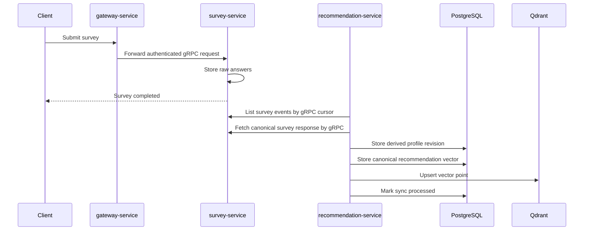
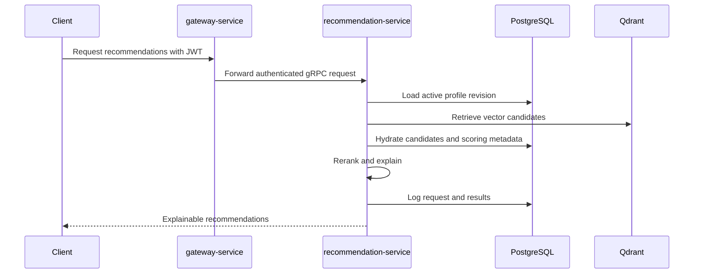

# Architecture

## Purpose

This document defines the minimum architecture for `recommendation-service`.
It is the source of truth for service ownership, data ownership, and system
boundaries.

## Document Contract

### Why This File Exists

- Keeps the service aligned with the broader On the Block platform.
- Defines what this service owns and what it must never own.
- Provides the architectural frame for database, API, sync, and recommendation
  design.

### What MUST Be Documented Here

- Service boundaries.
- Canonical vs derived storage rules.
- High-level data flow.
- Deployment shape for MVP.
- Rebuildability requirements.
- Cross-service communication rules.

### What MUST NOT Be Documented Here

- Table-level schema details. Use `database/erd.md`.
- Endpoint-level API details. Use `api/recommendation-api.md`.
- Vector dimensions. Use `recommendation/vector-schema.md`.
- Survey mapping rules. Use `recommendation/survey-mapping.md`.

### Recommended Sections

1. Purpose
2. Platform Context
3. Ownership Boundaries
4. Storage Architecture
5. High-Level Flows
6. Deployment Shape
7. Failure Boundaries
8. Update Rules

### Engineering Constraints

- PostgreSQL is canonical for recommendation-owned state.
- Qdrant is a derived vector index and must be rebuildable.
- Raw survey answers belong to `survey-service`.
- Authentication belongs to `auth-service`.
- All cross-service writes are eventually consistent.
- Distributed transactions are forbidden.

### Update Rules

- Update when service boundaries or deployment assumptions change.
- Do not add implementation details better owned by lower-level docs.
- Any boundary change should reference `decisions/adr-001-derived-state.md`.

## Platform Context

```text
Client
  -> gateway-service
      -> auth-service
      -> survey-service
      -> recommendation-service
```

Service-to-service communication is gRPC-first. HTTP in this repository is
reserved for health/status endpoints and local debugging unless explicitly
documented otherwise.

Service ownership:

| Service | Owns | Does Not Own |
|---|---|---|
| `auth-service` | OAuth, users, JWT issuing, identity lifecycle | Surveys, recommendations |
| `gateway-service` | Public routing, request validation, edge concerns | Business state |
| `survey-service` | Survey schemas, raw answers, answer revisions | Taste vectors, recommendations |
| `recommendation-service` | Derived taste profiles, vectors, scoring metadata, recommendation logs | Auth, raw survey truth |

## Storage Architecture

```text
PostgreSQL
  Canonical recommendation-owned state:
  - derived taste profiles
  - profile revisions
  - vector schema versions
  - mapper versions
  - recommendation vectors
  - scoring configs
  - recommendation logs
  - Qdrant indexing metadata
  - sync cursors and failure state

Qdrant
  Rebuildable derived index:
  - beverage vectors
  - venue vectors
  - menu-item vectors
```

Qdrant MUST NOT contain the only copy of any state required for rebuild,
explanation, or audit.

## High-Level Survey Sync Flow



## High-Level Recommendation Flow



## Deployment Shape

MVP deployment SHOULD use:

- One gRPC service process/container.
- Optional FastAPI health/debug process/container.
- One background worker process/container for sync and indexing.
- PostgreSQL with PostGIS.
- Qdrant with persistent volume.
- Alembic migrations.
- Structured logs and health checks.

MVP deployment SHOULD NOT require Kafka, Airflow, Redis, or an ML serving stack.

## Failure Boundaries

- If survey sync fails, recommendation profile status becomes `failed_generation`
  or remains stale until retry succeeds.
- If Qdrant indexing fails, PostgreSQL remains canonical and the vector point is
  marked `pending` or `failed`.
- If recommendation profile is missing, APIs return a typed profile status rather
  than inventing recommendations from raw survey data.
