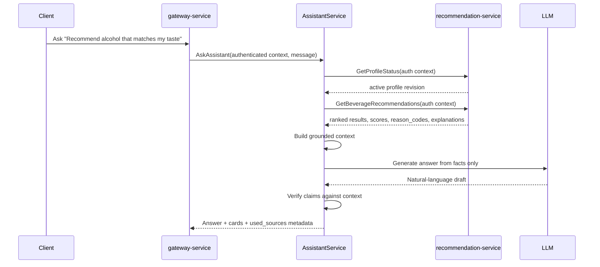
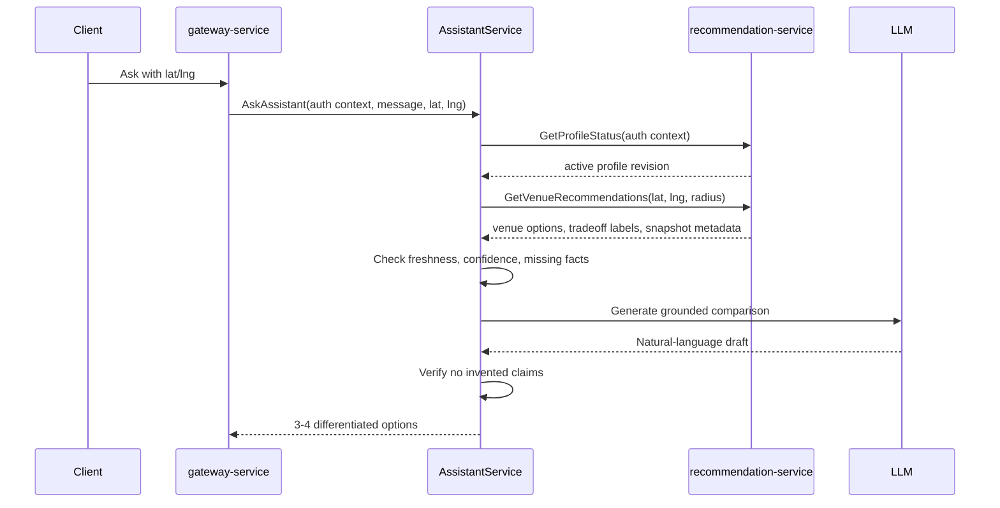

# Assistant Architecture

## Purpose

This document defines the MVP architecture for the ONTHEBLOCK AI assistant.

The assistant is an app-domain conversational layer that helps users with:

- alcohol recommendations
- user taste and preference explanations
- nearby venue, store, and bar recommendations
- price, distance, and availability comparisons
- app-owned recommendation explanations

The assistant MUST NOT answer unrelated general questions.

## Document Contract

### Why This File Exists

- Defines where the assistant fits in the MSA architecture.
- Prevents the LLM from becoming the recommendation ranking engine.
- Keeps assistant behavior grounded in recommendation-service facts.
- Gives future API, prompt, and evaluation work one architecture source.

### What MUST Be Documented Here

- Assistant service boundary.
- Cross-service call flow.
- Supported assistant intents.
- Recommendation-service dependency rules.
- Profile and venue recommendation flows.
- MVP vs future scope.

### What MUST NOT Be Documented Here

- Final protobuf definitions. Use `response-schema.md` until proto is accepted.
- Prompt text details. Use `prompt-contract.md`.
- RAG guardrails. Use `rag-policy.md`.
- Evaluation datasets. Use `evaluation-policy.md`.
- Recommendation scoring formulas. Use `../recommendation/recommendation-logic.md`.

## Architecture Summary

The assistant is an orchestration layer behind `gateway-service`.

```text
Client
  -> gateway-service
      -> auth-service
      -> AssistantService
          -> recommendation-service
              -> PostgreSQL recommendation state
              -> Qdrant rebuildable vector index
              -> map/place read-model snapshots
```

The assistant receives authenticated context from the gateway. It MUST NOT
accept `user_id` from the client body.

The assistant calls `recommendation-service` for deterministic recommendation
facts. The LLM only rewrites those facts into natural language.

## Service Boundary

| Area | Owner | Assistant Rule |
|---|---|---|
| Authentication and identity | `auth-service` | Use gateway-authenticated context only |
| Raw survey answers | `survey-service` | Never read directly |
| Taste profiles | `recommendation-service` | Read derived profile status and summaries |
| Recommendation scores | `recommendation-service` | Never recompute with the LLM |
| Reason codes | `recommendation-service` | Preserve and surface in grounded language |
| Canonical places | `map-service` or `place-service` | Never read or write canonical DB directly |
| Venue recommendation facts | `recommendation-service` | Use read-model-backed recommendation results |
| Natural-language answer | Assistant layer | Generate only from grounded context |

## Non-Negotiable Rules

- The LLM MUST NOT rank alcohols, venues, stores, or bars.
- The LLM MUST NOT invent beverage names, place names, prices, inventory,
  distances, route times, or explanations.
- Recommendation ranking MUST remain deterministic and owned by
  `recommendation-service`.
- No retrieved evidence means no answer.
- If facts are missing, stale, low-confidence, or outside app scope, the
  assistant MUST say so.
- The assistant MUST preserve internal source metadata for traceability.
- The assistant MUST NOT expose raw internal IDs unless the client contract
  requires them.

## Supported MVP Intents

| Intent | Meaning | Required Tooling |
|---|---|---|
| `recommend_beverage` | Recommend alcohol for the authenticated user | Profile status + beverage recommendations |
| `find_nearby_venue` | Find nearby venue/store/bar options | Profile status + venue recommendations + location |
| `compare_purchase_options` | Compare price, distance, and availability tradeoffs | Venue recommendations with purchase-option labels |
| `explain_preference` | Explain user's derived taste profile | Profile status + taste profile summary |
| `explain_recommendation` | Explain why a result was recommended | Recommendation result, scores, reason codes |
| `profile_status` | Explain missing, pending, stale, or failed profile state | Profile status |
| `out_of_scope` | Refuse unrelated questions | No tool call required after scope detection |
| `insufficient_data` | Decline when app facts are not enough | Source and missing-fact metadata |

## Assistant Flow

```text
1. Receive authenticated request from gateway-service.
2. Resolve user identity from JWT/gateway context.
3. Classify intent and required facts.
4. Reject out-of-scope requests.
5. Call recommendation-service APIs for deterministic facts.
6. Build grounded assistant context from returned facts only.
7. Verify that required facts meet freshness and confidence policy.
8. Ask LLM to generate a response from the grounded context.
9. Run response verifier against the grounded context.
10. Return answer, cards, source metadata, missing facts, and refusal state.
```

## Beverage Recommendation Flow



## Nearby Venue Flow



## Venue Recommendation Facts

Venue recommendation facts MAY include:

- `place_id`
- place name
- place type
- distance
- estimated travel time
- route complexity
- price
- availability status
- inventory confidence
- price confidence
- place revision
- inventory revision
- price revision
- map snapshot revision

The assistant MUST treat these as read facts. It MUST NOT mutate them.

## Purchase Option Tradeoffs

Nearby venue answers SHOULD return differentiated options when data allows:

| Option | Meaning |
|---|---|
| `nearest_reasonable` | Close option with acceptable taste and availability fit |
| `best_price` | Lowest reliable price among acceptable matches |
| `balanced_best` | Strong combined taste, distance, price, and confidence result |
| `high_taste_match_farther` | Strong taste match that is farther than closer options |

The assistant MUST NOT create these labels independently. They must come from
`recommendation-service` results or documented deterministic post-processing.

## Profile State Handling

| Profile State | Assistant Behavior |
|---|---|
| `missing` | Ask user to complete the survey |
| `pending_generation` | Explain that the taste profile is being generated |
| `active` | Continue with recommendation flow |
| `stale` | May serve stale result only if recommendation-service marks it usable |
| `regenerating` | Explain current regeneration state; avoid fresh claims |
| `failed_generation` | Return typed failure explanation |

The assistant MUST NOT infer taste from raw survey answers or chat text.

## MVP Scope

MVP SHOULD include:

- intent classification
- out-of-scope refusal
- recommendation-service tool calls
- grounded context builder
- no-answer policy
- response verifier
- cards for beverage and venue results
- internal used-source metadata
- evaluation set for no-answer and hallucination prevention

MVP SHOULD NOT include:

- fine-tuning
- model training
- LLM-based ranking
- autonomous map/place database access
- general web search
- long-term Kakao response storage
- distributed workflows or 2PC

## Future Scope

Future work MAY include:

- assistant conversation memory with explicit retention policy
- provider abstraction for multiple LLM vendors
- streaming responses
- richer multi-turn recommendation refinement
- multilingual prompt variants
- human feedback review tools
- research-inspired warm-up learning experiments

Warm-up learning MUST remain research-only until a separate design documents
training data ownership, privacy, evaluation gates, rollback, and failure modes.

## Implementation Roadmap

### Phase 0: Documentation and Contracts

- Add assistant architecture, RAG policy, prompt contract, response schema, and
  evaluation policy.
- Decide whether `AssistantService` lives in a separate service repository or as
  a temporary thin orchestration module.
- Confirm protobuf workflow before generating proto files.

### Phase 1: Deterministic Assistant MVP

- Add intent classifier with allowlisted app-domain intents.
- Add recommendation-service client calls.
- Add grounded context builder.
- Add refusal and insufficient-data responses.
- Add response verifier.
- Add beverage and venue recommendation cards.

### Phase 2: Operational Hardening

- Add request tracing and internal source metadata.
- Add no-answer and hallucination regression tests.
- Add prompt versioning and evaluation fixtures.
- Add observability for refused, insufficient-data, and verifier-failed answers.

### Phase 3: Product Expansion

- Add multi-turn clarification.
- Add comparison workflows.
- Add richer map/place confidence display.
- Add controlled conversation memory if product policy allows it.

### Phase 4: Research

- Explore warm-up learning, personalization feedback, or fine-tuning only after
  MVP guardrails and evaluation are stable.

## Update Rules

- Update this document when assistant service boundaries, supported intents, or
  cross-service call flows change.
- Keep ranking rules in `../recommendation/recommendation-logic.md`.
- Keep response fields in `response-schema.md`.
- Keep hallucination and RAG rules in `rag-policy.md`.
