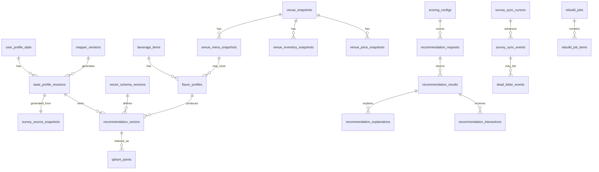

# ERD and Storage Model

## Purpose

This document defines the canonical PostgreSQL storage model and Qdrant indexing
metadata for `recommendation-service`.

## Document Contract

### Why This File Exists

- Makes recommendation-owned state explicit.
- Keeps PostgreSQL canonical and Qdrant rebuildable.
- Provides a stable target for migrations and AI-assisted implementation.

### What MUST Be Documented Here

- Tables owned by `recommendation-service`.
- Important columns and relationships.
- Canonical vs derived/indexed state.
- Qdrant metadata tables.
- Important indexes and partitioning rules.
- Rebuild and audit relevance.

### What MUST NOT Be Documented Here

- Raw survey-service tables.
- Auth-service user tables.
- Canonical map-service/place-service tables.
- Full SQL migration code.
- Recommendation scoring formulas.

### Recommended Sections

1. Purpose
2. Storage Principles
3. ERD
4. Table Definitions
5. Important Indexes
6. Partitioning
7. Qdrant Collection Metadata
8. Update Rules

### Engineering Constraints

- PostgreSQL MUST be canonical for all recommendation-owned state.
- Qdrant point metadata MUST be rebuildable from PostgreSQL vectors.
- Tables storing versioned artifacts SHOULD be append-only after activation.
- Recommendation events SHOULD be partitioned by time.
- Venue location search SHOULD use PostGIS.

### Update Rules

- Update before or with any schema migration.
- Every table change must include ownership, lifecycle, and rebuild impact.
- Do not document survey-service or auth-service private schemas here.

## Storage Principles

Canonical recommendation-owned state:

- profile revisions
- survey source identifiers and generation snapshots
- vector schema versions
- mapper versions
- recommendation vectors
- scoring configs
- beverage catalog data curated by recommendation-service
- map/place read-model snapshots copied from map-service/place-service
- recommendation request/result/explanation logs
- sync cursors and failure state

Derived rebuildable state:

- Qdrant collections
- Qdrant point payloads

## Implementation Readiness Rules

Before writing migrations:

- Implement version registry tables before generated profile/vector tables.
- Implement read-model snapshot tables, not canonical map/place tables.
- Keep survey source snapshots as generation evidence, not survey ownership.
- Add retry/dead-letter tables before enabling sync workers.
- Store vectors in PostgreSQL before indexing Qdrant.

## Beverage Catalog Foundation

The beverage catalog is the next MVP blocker before real Qdrant indexing.

Minimum PostgreSQL-owned foundation:

```text
beverage_items
  -> flavor_profiles
  -> recommendation_vectors
  -> qdrant_points later
```

Rules:

- `beverage_items` stores curated recommendation catalog identity and active
  state.
- `flavor_profiles` stores curated beverage taste metadata and reason-code
  hints.
- `recommendation_vectors` stores canonical `taste_v1` beverage vectors.
- Qdrant points are derived from `recommendation_vectors` only after PostgreSQL
  contains validated canonical beverage vectors.
- Seed/import must be idempotent and must not depend on Qdrant.

Detailed beverage catalog rules are documented in
`../recommendation/beverage-catalog.md`.

## ERD



## Table Definitions

### `user_profile_state`

One row per external user with current profile status.

Key fields:

- `external_user_id`
- `active_profile_revision_id`
- `status`
- `last_survey_response_id`
- `updated_at`

### `taste_profile_revisions`

Immutable derived profile revisions.

Key fields:

- `id`
- `external_user_id`
- `profile_revision`
- `survey_response_id`
- `survey_version`
- `survey_response_revision`
- `mapper_version_id`
- `vector_schema_version_id`
- `scoring_config_id`
- `taste_vector`
- `preferred_categories`
- `preferred_keywords`
- `budget_range`
- `experience_level`
- `status`
- `generated_at`

### `survey_source_snapshots`

Generation snapshot metadata. Not raw survey source of truth.

Key fields:

- `profile_revision_id`
- `survey_response_id`
- `snapshot_hash`
- `snapshot_json`
- `fetched_at`

### `vector_schema_versions`

Version registry for vector dimensions and metrics.

Key fields:

- `name`
- `version`
- `dimensions_json`
- `distance_metric`
- `status`

### `mapper_versions`

Version registry for survey-to-profile mapping.

Key fields:

- `name`
- `version`
- `code_hash`
- `rules_json`
- `status`

### `scoring_configs`

Versioned recommendation scoring metadata.

Key fields:

- `name`
- `version`
- `target_type`
- `category`
- `weights_json`
- `reason_code_rules_json`
- `status`

### `recommendation_vectors`

Canonical vector storage.

Key fields:

- `owner_type`
- `owner_id`
- `vector_schema_version_id`
- `vector`
- `vector_json`
- `confidence_json`
- `source_hash`
- `source_metadata_json`
- `created_at`

For beverage catalog vectors:

```text
owner_type = beverage_item
owner_id = beverage_items.id
```

These rows are the canonical beverage vectors. Qdrant indexes are rebuilt from
them.

### `qdrant_points`

Qdrant indexing metadata.

Key fields:

- `vector_id`
- `collection_name`
- `point_id`
- `payload_hash`
- `index_status`
- `indexed_at`
- `last_error`

### `beverage_items`

Curated beverage catalog.

Key fields:

- `id`
- `category`
- `name_ko`
- `name_en`
- `brand`
- `country`
- `region`
- `abv`
- `price_min_krw`
- `price_max_krw`
- `active`
- `description`
- `search_document`
- `metadata_json`

MVP metadata SHOULD include `catalog_key`, `style`, `source_type`,
`source_version`, `curation_status`, `tags`, `serving_context`, and
`reason_code_hints`.

`active = false` excludes the item from recommendation candidate generation.
It does not require deleting flavor profiles or vectors.

### `flavor_profiles`

Curated taste metadata for beverages, venue snapshots, or menu snapshots.

For the beverage MVP, use:

```text
owner_type = beverage_item
owner_id = beverage_items.id
```

Key fields:

- `owner_type`
- `owner_id`
- `flavor_tags`
- `profile_json`
- `curation_confidence`
- `source`
- `notes`

For beverage rows, `profile_json` SHOULD include named `taste_v1` dimension
values, dimension confidence, reason-code hints, and curation notes.

### `venue_snapshots`

Read-model snapshots of map-service/place-service venue data.

This table is not canonical place storage.

Key fields:

- `place_id`
- `place_revision`
- `name`
- `place_type`
- `address`
- `location geography(Point, 4326)`
- `status`
- `publication_status`
- `search_document`
- `snapshot_json`
- `source_event_id`
- `synced_at`
- `stale_after`

### `venue_menu_snapshots`

Read-model snapshots of published menu data.

Key fields:

- `place_id`
- `menu_item_id`
- `menu_revision`
- `beverage_item_id`
- `menu_name`
- `menu_type`
- `status`
- `snapshot_json`
- `synced_at`

### `venue_inventory_snapshots`

Read-model snapshots of availability data.

Key fields:

- `place_id`
- `beverage_item_id`
- `inventory_revision`
- `availability_status`
- `confidence`
- `last_seen_at`
- `expires_at`
- `synced_at`

### `venue_price_snapshots`

Read-model snapshots of price data.

Key fields:

- `place_id`
- `beverage_item_id`
- `menu_item_id`
- `price_revision`
- `price_krw`
- `price_type`
- `confidence`
- `valid_from`
- `valid_until`
- `synced_at`

### `recommendation_requests`

Request-level recommendation log.

Key fields:

- `external_user_id`
- `profile_revision_id`
- `target_type`
- `filters_json`
- `scoring_config_id`
- `request_context_json`
- `created_at`

### `recommendation_results`

Ranked result log.

Key fields:

- `request_id`
- `rank`
- `target_type`
- `target_id`
- `similarity_score`
- `final_score`
- `score_breakdown_json`
- `reason_codes`
- `source_snapshot_json`

### `recommendation_explanations`

Deterministic explanation payload.

Key fields:

- `result_id`
- `reason_codes`
- `matched_dimensions_json`
- `template_version`
- `explanation_text`
- `debug_json`

### `survey_sync_events`

Idempotent survey event processing state.

Key fields:

- `event_id`
- `event_type`
- `external_user_id`
- `survey_response_id`
- `response_revision`
- `status`
- `attempt_count`
- `next_retry_at`
- `last_error`

## Important Indexes

Required indexes:

```text
user_profile_state(external_user_id)
taste_profile_revisions(external_user_id, profile_revision desc)
taste_profile_revisions(survey_response_id, survey_response_revision, mapper_version_id)
recommendation_vectors(owner_type, owner_id, vector_schema_version_id)
qdrant_points(collection_name, point_id)
beverage_items(category, active)
flavor_profiles(owner_type, owner_id)
venue_snapshots using gist(location)
venue_snapshots(place_id, place_revision)
venue_snapshots(status, stale_after)
venue_menu_snapshots(place_id, beverage_item_id)
venue_inventory_snapshots(place_id, beverage_item_id, availability_status)
venue_inventory_snapshots(expires_at)
venue_price_snapshots(place_id, beverage_item_id)
venue_price_snapshots(valid_until)
survey_sync_events(event_id)
survey_sync_events(status, next_retry_at)
recommendation_results(request_id, rank)
```

Hybrid search indexes:

```text
beverage_items.search_document using gin
venue_snapshots.search_document using gin
trigram index on searchable Korean/English names
```

## Partitioning

Partition by month:

- `recommendation_requests`
- `recommendation_results`
- `recommendation_interactions`

Partitioning can be implemented after MVP traffic is known, but table design
SHOULD avoid blocking future partitioning.

## Qdrant Collections

Recommended collections:

```text
beverage_vectors_v1
venue_vectors_v1
menu_item_vectors_v1
```

Real Qdrant indexing SHOULD start only after PostgreSQL contains canonical
vectors for the relevant owner type. For beverage indexing, this means active
`beverage_items`, `flavor_profiles`, and `recommendation_vectors` already exist
and pass validation.

Qdrant payloads SHOULD include only filterable metadata:

```json
{
  "owner_id": "bev_123",
  "category": "whiskey",
  "active": true,
  "vector_schema_version": "taste_v1",
  "source_hash": "sha256..."
}
```
