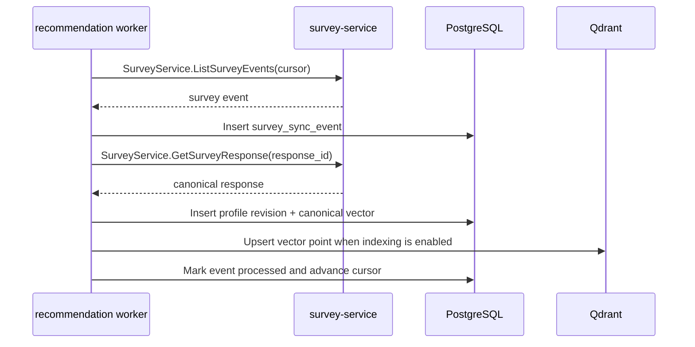

# Survey Sync Flow

## Purpose

This document defines how `recommendation-service` synchronizes with
`survey-service`, regenerates profiles, and recovers from failures without shared
databases or distributed transactions.

## Document Contract

### Why This File Exists

- Keeps cross-service synchronization reliable and simple.
- Defines eventual consistency behavior.
- Ensures profile rebuild and regeneration remain possible.

### What MUST Be Documented Here

- Event/update flow from `survey-service`.
- Sync cursor behavior.
- Idempotency rules.
- Retry and dead-letter rules.
- Profile lifecycle.
- Regeneration and rebuild flow.

### What MUST NOT Be Documented Here

- Survey table structure.
- Full recommendation ranking logic.
- Full API response schemas.
- Alembic migration details.

### Recommended Sections

1. Purpose
2. Ownership Boundary
3. Sync Strategy
4. Event Contract
5. Profile Lifecycle
6. Failure Handling
7. Rebuild Flow
8. Update Rules

### Engineering Constraints

- `recommendation-service` MUST NOT access the survey database.
- Sync MUST be idempotent.
- Eventual consistency is acceptable.
- 2PC and distributed transactions are forbidden.
- Failed Qdrant indexing MUST NOT lose canonical PostgreSQL vectors.
- Full profile regeneration MUST be possible from survey data plus versioned
  recommendation metadata.

### Update Rules

- Update when event schemas, cursor rules, retry rules, or profile lifecycle
  statuses change.
- Any change must state whether old events remain replayable.

## Sync Strategy

MVP SHOULD use pull-based sync over gRPC:

```text
survey-service durable event source
  -> recommendation-service polling worker
      -> fetch events by cursor through SurveyService RPC
      -> fetch canonical survey response through SurveyService RPC
      -> generate profile revision
      -> store vector in PostgreSQL
      -> mark Qdrant indexing pending or index Qdrant when indexing is enabled
      -> mark event processed
```

This can later move to a message broker without changing event semantics.
`recommendation-service` MUST NOT use direct survey database access.

The V1 sync input is a paginated survey-service event response. It is the
contract consumed by `recommendation-service`; it is not a survey-service
database schema.

Preferred gRPC contract:

```proto
service SurveyService {
  rpc ListSurveyEvents(ListSurveyEventsRequest)
      returns (ListSurveyEventsResponse);
  rpc GetSurveyResponse(GetSurveyResponseRequest)
      returns (GetSurveyResponseResponse);
}

message ListSurveyEventsRequest {
  string cursor = 1;
  int32 limit = 2;
}

message ListSurveyEventsResponse {
  string cursor = 1;
  string next_cursor = 2;
  bool has_more = 3;
  string event_watermark = 4;
  repeated SurveyEvent events = 5;
}

message SurveyEvent {
  string event_id = 1;
  string event_type = 2;
  google.protobuf.Timestamp occurred_at = 3;
  string external_user_id = 4;
  string survey_response_id = 5;
  string survey_version = 6;
  int32 response_revision = 7;
}

message GetSurveyResponseRequest {
  string survey_response_id = 1;
  int32 response_revision = 2;
}

message GetSurveyResponseResponse {
  string survey_response_id = 1;
  string external_user_id = 2;
  string survey_version = 3;
  int32 response_revision = 4;
  google.protobuf.Timestamp completed_at = 5;
  google.protobuf.Struct answers = 6;
}
```

Until the deployed survey-service proto is available in this repository,
`recommendation-service` may test against a protocol/fake client and may use an
explicitly configured internal service API with the same fields. Do not
implement sync against survey-service private tables or inferred schemas.

## Deployed Survey Result Adapter

The deployed survey-service observed on 2026-05-27 exposes gRPC service
`ontheblock.survey.v1.SurveyService` with:

```text
GetSurveyQuestions
SubmitSurvey
GetSurveyResult
GetSurveyResultByUser
```

It does not yet expose the cursor-based sync RPCs above. For staging only,
`recommendation-service` has a controlled adapter for `GetSurveyResult` and
`GetSurveyResultByUser`:

```bash
SURVEY_SERVICE_GRPC_ADDR=survey-service-vcuepibcwq-du.a.run.app:443 \
python3 -m app.tools.survey_result_adapter \
  --external-user-id <safe-user-id> \
  --dry-run
```

The adapter maps `SurveyResult` to the `survey_v1` profile input:

| SurveyResult field | Mapper input |
|---|---|
| `survey_id` | `survey_response_id` |
| `user_id` | `external_user_id` |
| `level` | `answers.experience_level` |
| `categories` | `answers.categories` |
| `whiskey`, `wine`, `cocktail`, `beer` | `answers.category_traits` |
| `flavor_keywords` | `answers.global_keywords` |
| `budget` | `answers.budget_range` |
| `submitted_at` | `completed_at` |

The deployed survey answer keys are category-based, not question-number based.
`survey_mapper_v1_1` accepts the 2026-05-26 value set:

```text
level = beginner | enthusiast | expert
categories = whiskey | wine | cognac | cocktail | beer
whiskey = bourbon_character | sherry_character | peat_character | floral_citrus | american_whiskey
wine = full_red | light_red_rose | white | sparkling | fortified
cocktail = tropical_tiki | tart_balanced | refreshing_long | dessert_cream | bold_spirit_fwd
beer = lager_pilsner | weizen_white | pale_ale_ipa | stout_porter | sour_wild
flavor_keywords = vanilla_caramel | citrus_berry | dried_choco | oak_woody | smoky_peated | almond_nutty | floral | spicy | herb_mint
budget = under_30k | 30k_100k | 100k_200k | over_200k
```

Normalization rules:

- `cognac` is stored as internal category `brandy_cognac`.
- `cognac` has no sub-preference array in the deployed contract.
- Empty `whiskey`, `wine`, `cocktail`, or `beer` arrays are omitted from
  `answers.category_traits`.
- Budget labels are normalized to numeric internal ranges:
  `under_30000`, `30000_100000`, `100000_200000`, `over_200000`.

Direct SQL against `survey.survey_responses` is allowed only as a
survey-service operator/debugging action. It is forbidden as a
recommendation-service integration path.

This adapter MUST NOT be treated as production sync. It has no durable cursor,
event ID stream, response revision, revocation event, or schema-published event.
Production sync still requires `ListSurveyEvents` and `GetSurveyResponse` or a
later reviewed replacement contract with equivalent idempotency and replay
semantics.

## Event Contract

Minimum survey event:

```json
{
  "event_id": "evt_123",
  "event_type": "survey.response_completed",
  "occurred_at": "2026-05-08T12:00:00Z",
  "external_user_id": "usr_123",
  "survey_response_id": "surv_resp_123",
  "survey_version": "survey_v1",
  "response_revision": 1
}
```

Minimum survey response:

```json
{
  "survey_response_id": "surv_resp_123",
  "external_user_id": "usr_123",
  "survey_version": "survey_v1",
  "response_revision": 1,
  "completed_at": "2026-05-08T12:00:00Z",
  "answers": {
    "experience_level": "beginner",
    "categories": ["whiskey"],
    "category_traits": {"whiskey": ["vanilla_caramel"]},
    "global_keywords": ["vanilla_caramel"],
    "budget_range": "30000_100000"
  }
}
```

Supported event types:

| Event Type | Meaning |
|---|---|
| `survey.response_completed` | Generate or replace active profile from completed survey |
| `survey.response_updated` | Regenerate profile from new response revision |
| `survey.response_revoked` | Mark derived profile unavailable or stale |
| `survey.schema_published` | No immediate profile generation; review mapper compatibility |

## Idempotency Rules

Idempotency key:

```text
event_id
```

Profile generation uniqueness key:

```text
external_user_id + survey_response_id + response_revision + mapper_version
```

Reprocessing the same event MUST NOT create duplicate active profiles.

## Profile Lifecycle

```text
missing
  -> pending_generation
  -> active
  -> stale
  -> regenerating
  -> active
  -> failed_generation
```

Status meanings:

| Status | Meaning |
|---|---|
| `missing` | No profile exists |
| `pending_generation` | Survey event received but profile not generated |
| `active` | Profile can serve recommendations |
| `stale` | New survey data exists but active profile is older |
| `regenerating` | New revision is being generated |
| `failed_generation` | Profile generation failed and is retryable or dead-lettered |

## Sequence Diagram



## Failure Handling

Retryable failures:

- network timeout calling `survey-service`
- temporary survey API failure
- temporary PostgreSQL transaction failure
- temporary Qdrant indexing failure

Non-retryable or dead-letter candidates:

- invalid event schema
- missing required survey response after repeated attempts
- unsupported survey version with no compatible mapper
- mapper validation failure

Failures MUST persist:

- event payload
- attempt count
- last error
- next retry time
- dead-letter reason when applicable

Dead-lettered events MUST be inspectable and replayable after the underlying
contract or data issue is fixed.

## Rebuild Flow

```text
1. Select rebuild scope: all users, date range, or user list.
2. Fetch canonical survey responses from survey-service.
3. Generate new profile revisions with selected mapper/vector/scoring versions.
4. Store generated profiles and vectors in PostgreSQL.
5. Recreate or backfill Qdrant collections from PostgreSQL.
6. Verify counts, hashes, and sample recommendations.
7. Promote rebuilt revisions to active.
```

Qdrant rebuild MUST start from PostgreSQL vectors, not from survey-service
directly.

Profile rebuild MUST fetch canonical survey responses through survey-service
APIs. Stored generation snapshots may be used for audit comparison but are not
the primary rebuild source when survey-service is available.
