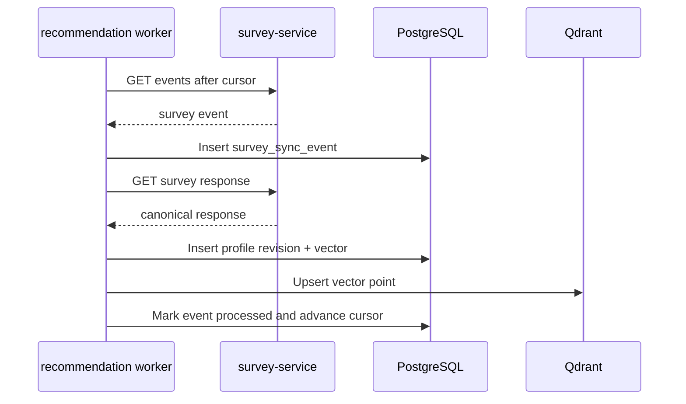

# Survey Sync Flow

## Purpose

This document defines how `recommendation-service` synchronizes with
`survey-service`, regenerates profiles, and recovers from failures without shared
databases or distributed transactions.

## Document Contract

### Why This File Exists

- Keeps cross-service synchronization reliable and simple.
- Defines eventual consistency behavior.
- Ensures profile rebuild and regeneration remain possible.

### What MUST Be Documented Here

- Event/update flow from `survey-service`.
- Sync cursor behavior.
- Idempotency rules.
- Retry and dead-letter rules.
- Profile lifecycle.
- Regeneration and rebuild flow.

### What MUST NOT Be Documented Here

- Survey table structure.
- Full recommendation ranking logic.
- Full API response schemas.
- Alembic migration details.

### Recommended Sections

1. Purpose
2. Ownership Boundary
3. Sync Strategy
4. Event Contract
5. Profile Lifecycle
6. Failure Handling
7. Rebuild Flow
8. Update Rules

### Engineering Constraints

- `recommendation-service` MUST NOT access the survey database.
- Sync MUST be idempotent.
- Eventual consistency is acceptable.
- 2PC and distributed transactions are forbidden.
- Failed Qdrant indexing MUST NOT lose canonical PostgreSQL vectors.
- Full profile regeneration MUST be possible from survey data plus versioned
  recommendation metadata.

### Update Rules

- Update when event schemas, cursor rules, retry rules, or profile lifecycle
  statuses change.
- Any change must state whether old events remain replayable.

## Sync Strategy

MVP SHOULD use pull-based sync:

```text
survey-service durable event source
  -> recommendation-service polling worker
      -> fetch event by cursor
      -> fetch canonical survey response
      -> generate profile revision
      -> store vector in PostgreSQL
      -> index Qdrant
      -> mark event processed
```

This can later move to a message broker without changing event semantics.

## Event Contract

Minimum survey event:

```json
{
  "event_id": "evt_123",
  "event_type": "survey.response_completed",
  "occurred_at": "2026-05-08T12:00:00Z",
  "external_user_id": "usr_123",
  "survey_response_id": "surv_resp_123",
  "survey_version": "survey_v1",
  "response_revision": 1
}
```

Supported event types:

| Event Type | Meaning |
|---|---|
| `survey.response_completed` | Generate or replace active profile from completed survey |
| `survey.response_updated` | Regenerate profile from new response revision |
| `survey.response_revoked` | Mark derived profile unavailable or stale |
| `survey.schema_published` | No immediate profile generation; review mapper compatibility |

## Idempotency Rules

Idempotency key:

```text
event_id
```

Profile generation uniqueness key:

```text
external_user_id + survey_response_id + response_revision + mapper_version
```

Reprocessing the same event MUST NOT create duplicate active profiles.

## Profile Lifecycle

```text
missing
  -> pending_generation
  -> active
  -> stale
  -> regenerating
  -> active
  -> failed_generation
```

Status meanings:

| Status | Meaning |
|---|---|
| `missing` | No profile exists |
| `pending_generation` | Survey event received but profile not generated |
| `active` | Profile can serve recommendations |
| `stale` | New survey data exists but active profile is older |
| `regenerating` | New revision is being generated |
| `failed_generation` | Profile generation failed and is retryable or dead-lettered |

## Sequence Diagram



## Failure Handling

Retryable failures:

- network timeout calling `survey-service`
- temporary survey API failure
- temporary PostgreSQL transaction failure
- temporary Qdrant indexing failure

Non-retryable or dead-letter candidates:

- invalid event schema
- missing required survey response after repeated attempts
- unsupported survey version with no compatible mapper
- mapper validation failure

Failures MUST persist:

- event payload
- attempt count
- last error
- next retry time
- dead-letter reason when applicable

## Rebuild Flow

```text
1. Select rebuild scope: all users, date range, or user list.
2. Fetch canonical survey responses from survey-service.
3. Generate new profile revisions with selected mapper/vector/scoring versions.
4. Store generated profiles and vectors in PostgreSQL.
5. Recreate or backfill Qdrant collections from PostgreSQL.
6. Verify counts, hashes, and sample recommendations.
7. Promote rebuilt revisions to active.
```

Qdrant rebuild MUST start from PostgreSQL vectors, not from survey-service
directly.

